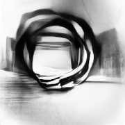
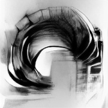
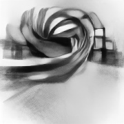
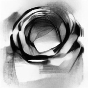
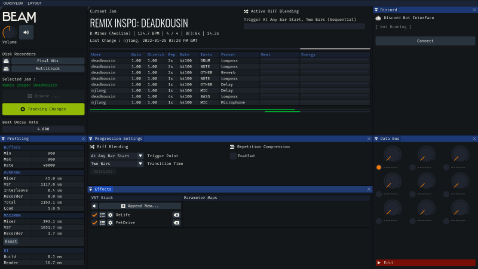

## OUROVEON

   

Experimental audio projects built to interact with data from [Endlesss](https://endlesss.fm). **OUROVEON** is a set of interconnected apps, slowly being built from modular components around an evolving "Endlesss SDK"; one part a learning exercise in audio coding and one part laboratory for ideas that build upon Endlesss' particular data model.

#### NOTE

These are experimental toys, not (yet) finished products. That said, a lot of love, care and real-world testing has been put into their development - just do be aware that functionality and UI is subject to change rapidly and randomly as the potentials are explored!

 
 

# FRAMEWORK

Beyond standard shared components like UI, profiling and logging functionality, the application framework provides a handful of specialised components and utilities, such as

* **Endlesss SDK** - a robust set of data types, audio processing, asynchronous network management as well as a toolbox of additional utilities (such )

* **Discord Direct** - native low-level connection via the Discord bot interface to stream high-quality, stereo application audio out to a voice channel

* **Signal Processing** - VST 2.x hosting, with VST3 to come; FFT and q_lib biquad filters

 
 

# BEAM

### __Live Jam Broadcast & Recording__

*Get the very best out of your live Endlesss performances*

_BEAM_ connects to a chosen jam, watches for changes, syncs live stems and produces a high-quality broadcastable mix with additional features like

* **smooth riff transitions** with configurable blending and timing
* recording-to-disk of both raw multitrack 8-channel Endlesss feed as well as simultaneous final mix output through VST chain
* "performance compression" mode for multitrack, where the primary changes and 'movement' from a jam session is streamed to disk, producing a focused, less-repetitive souvenir
* native connection to Discord audio broadcast channels via a Bot interface
* built-in VST 2.x hosting (on Windows) with configurable automation
* offline per-stem beat-analysis
* real-time export of live data for vizualisations in external tools, such as game engines or broadcast front-ends

_BEAM_ has so far broadcast over 50 hours of jam sessions without missing a beat, including running for a sustained [24-hour live set](https://www.youtube.com/watch?v=DHh6k6ehYDg).

The _BEAM_ live visualisation sync functionality was used along with the [NESTDROP](https://nestimmersion.ca/nestdrop.php) visualiser and the Unity 3D engine to broadcast [this hour-long jam](https://www.youtube.com/watch?v=cQ2DRpkBmyE)

 
 

# LORE

### __Offline Jam Exploration__

Browsing large jams in the Endlesss app is a challenge. _LORE_ exists to make discovering all the music hidden inside jams a delight. Passively download jams of any size, explore them interactively with fast preview playback and a full stem caching system. Visualise jam data in ways you've never tried before.

Featuring a simple riff sequencer and timing tool, _LORE_ is also the scaffolding to a future song arrangement editor.

 

 

## PLATFORM SUPPORT

OUROVEON is written in C++20 and aims to ultimately be buildable on *Windows*, *macOS* (M1 and Intel) and *Linux* including for *Raspberry Pi*. 

As of writing, Windows is the primary platform. A parallel refactoring project is underway to provide full cross-platform support.

## PREBUILT BINARIES

Use the dedicated installer or simply clone https://github.com/Unbundlesss/OUROVEON-build - the apps require minimal configuration and only store data in the user's configuration directory (`%APPDATA%\OUROVEON` on Windows) and a nominated data storage root. 

 

 

## DOCUMENTATION

User guides are slowly coming online in the /doc directory.