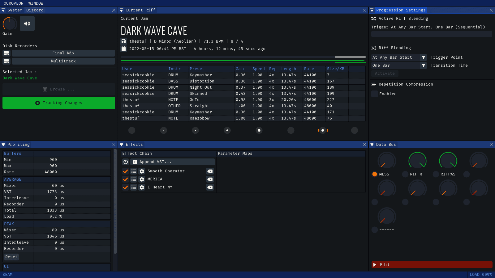
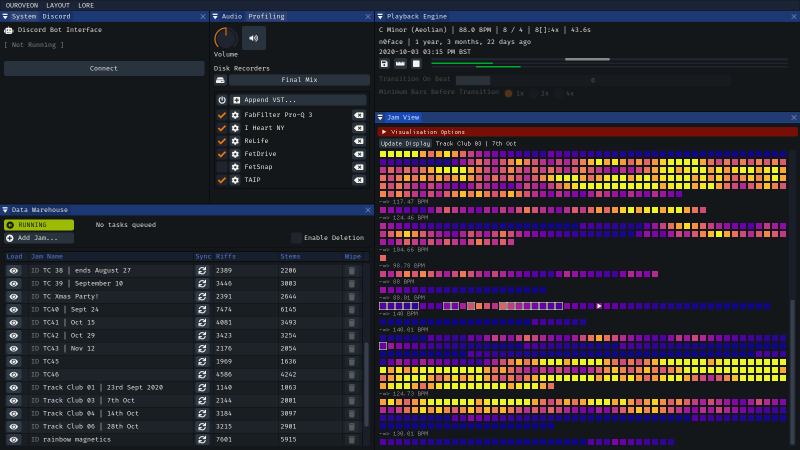

Experimental audio projects built to interact with data from multiplayer music collaboration app [Endlesss](https://endlesss.fm). **OUROVEON** is a set of interconnected apps, slowly being built from modular components around an evolving "Endlesss SDK"; one part a learning exercise in audio coding and one part laboratory for ideas that build upon Endlesss' particular data model.

NB. These are experimental toys, not finished products (yet), so please set your expectations accordingly. That said, a lot of love, care and substantial real-world testing has been put into their development - just do be aware that functionality and UI is subject to change rapidly and randomly as the potentials are explored!

 

## PLATFORM SUPPORT & AVAILABILITY

**OUROVEON** is written in C++20, built using [Premake](premake.github.io) and targets *Windows*, *MacOS 10.15+* (Universal arm64 + x86_64) and *Linux*, although the latter is only being tested on *Ubuntu 21*. *Raspberry Pi 3+* is also hopefully possible.

[Pre-built releases](https://github.com/Unbundlesss/OUROVEON/releases) are made available for **Windows** and **MacOS** (*signed + notarised*)

The apps are designed to be largely 'portable' and require minimal configuration, only storing data in the user's configuration directory (eg. `%APPDATA%\OUROVEON` on Windows) and a nominated data storage root.

At time of writing the only difference between the platforms is **VST support**, which is Windows-only presently. Cross-platform VST3 support is planned, ditto CLAP.

 
 

# BEAM

### __Live Jam Broadcast & Recording__

*Get the very best out of your live Endlesss performances*

_BEAM_ connects to a chosen jam, watches for changes, syncs live stems and produces a high-quality broadcastable mix with additional features like

* **smooth riff transitions** with configurable blending and timing. no more glitchy hard cuts at weird times between riffs.
* recording-to-disk of both raw (FLAC) multitrack 8-channel Endlesss feed as well as simultaneous final mix output through VST chain
* "performance compression" mode for multitrack, where the primary changes and 'movement' from a jam session is streamed to disk, producing a focused, less-repetitive souvenir
* native connection to Discord audio broadcast channels via a Bot interface
* built-in VST 2.x hosting (on Windows) with configurable automation
* offline per-stem beat-analysis
* real-time export of live data for vizualisations in external tools, such as game engines or broadcast front-ends

_BEAM_ has so far broadcast over 50 hours of jam sessions without missing a beat, including running for a sustained [24-hour live set](https://www.youtube.com/watch?v=DHh6k6ehYDg).

The _BEAM_ live visualisation sync functionality was used along with the [NESTDROP](https://nestimmersion.ca/nestdrop.php) visualiser and the Unity 3D engine to broadcast [this hour-long jam](https://www.youtube.com/watch?v=cQ2DRpkBmyE)

 
 

# LORE

### __Offline Jam Exploration__

*Jam data supremacy*

Browsing large jams in the Endlesss app is a challenge. _LORE_ exists to make discovering all the music hidden inside jams a delight. The largest jams on the platform (40,000+ riffs) can be visualised in their entireity with no lag even on very low-power GPU hardware.

Robustly download jams of any size from any era (_LORE_ can patch and fix some of the more broken or weird data storage quirks from old versions of Endlesss), explore them interactively with super-fast preview playback and a full stem caching system. Visualise jam data in ways you've never tried before, understand the ebb and flow of jams, find your own riffs trivially (as well as the riffs of your friends)

Featuring a simple riff sequencer and timing tool, _LORE_ is also the scaffolding to a future song arrangement editor and more comprehensive data archival methods.

 

 

# SDK / APP FRAMEWORK

Beyond standard shared components like UI, profiling and logging functionality, the application framework provides a handful of specialised components and utilities, such as

* **Endlesss SDK** - a robust set of data types, audio processing, asynchronous network management as well as a toolbox of additional utilities (such as offline caching, an sqlite3-based jam archival database system)

* **Discord Direct** - native low-level connection via the Discord bot interface to stream high-quality, stereo application audio out to a voice channel

* **Signal Processing** - VST 2.x hosting, with VST3 to come; FFT and q_lib biquad filters

 

 

## DOCUMENTATION

User guides are slowly coming online in the /doc directory.