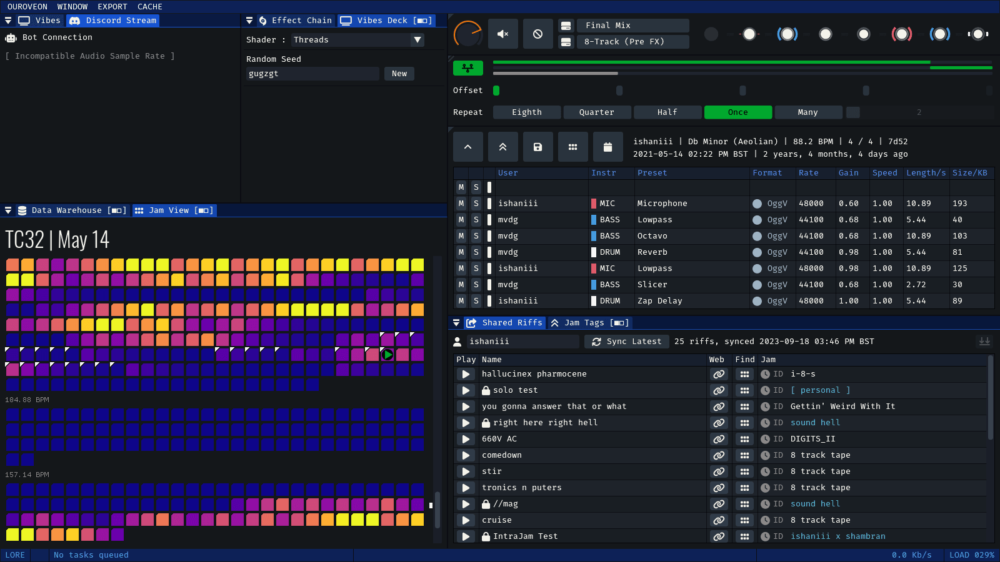
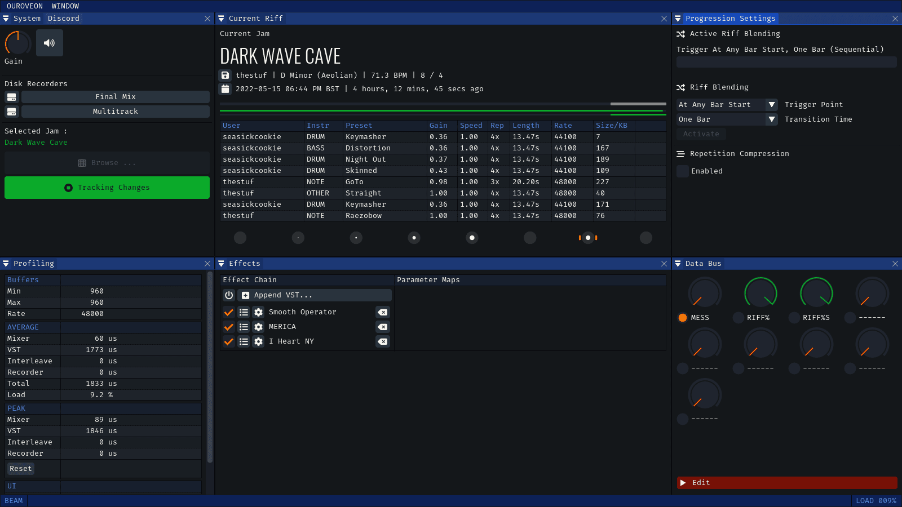

Experimental audio projects built to interact with data from multiplayer music collaboration app [Endlesss](https://endlesss.fm). **OUROVEON** is a set of interconnected apps, built from modular components around an evolving, homebrew "Endlesss SDK" (as an official SDK does not exist). One part a learning exercise in lower-level audio coding and one part laboratory for ideas that build upon Endlesss' particular data model.

Many months of tinkering, stressing and real-world testing have already gone into the **OUROVEON** suite but they should still be considered unfinished alpha/beta-grade products. UI and functionality may change rapidly without warning!

**These tools and all code within are not affiliated with or endorsed by Endlesss Ltd. Use at your own risk.**

 

**OUROVEON** is written in C++20, built using [Premake](premake.github.io) and targets *Windows*, *MacOS 10.15+* (Universal arm64 + x86_64) and *Linux* (locally tested on x86_64 Ubuntu 23).

[Pre-built releases](https://github.com/Unbundlesss/OUROVEON/releases) are made available for **Windows** and **MacOS** (*signed, notarised and ready to run*)

 

Shared Features

 * $\textcolor{orange}{\textsf{Endlesss Power}}$ ~ The custom SDK provides comprehensive support for many facets of **Endlesss**' services, including

   * Authenticated sign-in, or fallback to a limited API set using public endpoints
   * Fetching all subscribed jams and metadata for a logged-in user
   * Lossless mode (*2023*)
   * Shared local stem cache, managed per-jam for easier auditing
   * Offline cache of all known public jams, active users, jam names
   * Deals with quirky and damaged Endlesss data, all the way back to the earliest jams in 2019
   * Shared Riff feed parsing and riff launching
   * Built in retry/adapt fixes for unstable networks or servers

 * $\textcolor{orange}{\textsf{Audio Engine}}$

   * Lean audio mixers built on [PortAudio](https://www.portaudio.com/)
   * High-quality resampling using [r8brain](https://github.com/avaneev/r8brain-free-src)
   * Beat-analysis and energy estimation, drives UI and OpenGL shader-based visualisers
   * Support for FLAC and Ogg Vorbis source formats
   * Support for FLAC and WAV output - 9 simultaneous, asynchronous streams (depending on your hardware)
   * (*Windows Only*) VST effect hosting & automation
   * (*Windows Only*) IPC exchange of mixer state, beats, energy, jammer names, etc

 * $\textcolor{orange}{\textsf{UI Rendering}}$

   * Cross-platform front-end using [GLFW](https://www.glfw.org/)
   * Layout and controls running on [Dear ImGui](https://github.com/ocornut/imgui)

 

 

# LORE

### __Deluxe Jam Archeology__

**Endlesss** is incredible for making a lot of music, quickly. It's *really terrible* at navigating back through that music, finding what you want and getting it exported. **LORE** was born to comprehensively solve these issues as well as offering an opportunity for long-term offline archival and storage of years' worth of music.

Features

* $\textcolor{orange}{\textsf{Built For Scale}}$ ~ Download and synchronise even the largest (techno) jams on the platform. Navigating through 50,000+ riffs in LORE is a breeze, offering various data visualisation systems and username-searching.

* $\textcolor{orange}{\textsf{Built For Speed}}$ ~ Rapid and durable even on older, limited hardware. Fully multithreaded.

* $\textcolor{orange}{\textsf{Local Ownership}}$ ~ Download, explore, tag, export & archive your Endlesss music forever, even if the Endlesss cloud service disappears.

* $\textcolor{orange}{\textsf{Song Sketching}}$ ~ Pick and instantly play any riff, build simple sequences with transition timing, create bookmarks to help plan future tracks and exports.

* $\textcolor{orange}{\textsf{Open Data Formats}}$ ~ Everything is stored in easy-to-read `sqlite3` or JSON, trivially accessible or extended by other 3rd party tools.

 

 

# BEAM

### __Live Jam Broadcast & Recording__

*Get the very best out of your live Endlesss performances*

### NOTE: **BEAM** has not been actively developed recently as **LORE** has taken priority. It may end up being heavily refactored.

_BEAM_ connects to a chosen jam, watches for changes, syncs live stems and produces a high-quality broadcastable mix with additional features like

* **smooth riff transitions** with configurable blending and timing. no more glitchy hard cuts at weird times between riffs.
* recording-to-disk of both raw (FLAC) multitrack 8-channel Endlesss feed as well as simultaneous final mix output through VST chain
* "performance compression" mode for multitrack, where the primary changes and 'movement' from a jam session is streamed to disk, producing a focused, less-repetitive souvenir
* native connection to Discord audio broadcast channels via a Bot interface
* offline per-stem beat-analysis
* real-time export of live data for vizualisations in external tools, such as game engines or broadcast front-ends

_BEAM_ has so far broadcast over 50 hours of jam sessions without missing a beat, including running for a sustained [24-hour live set](https://www.youtube.com/watch?v=DHh6k6ehYDg).

The _BEAM_ live visualisation sync functionality was used along with the [NESTDROP](https://nestimmersion.ca/nestdrop.php) visualiser and the Unity 3D engine to broadcast [this hour-long jam](https://www.youtube.com/watch?v=cQ2DRpkBmyE)

