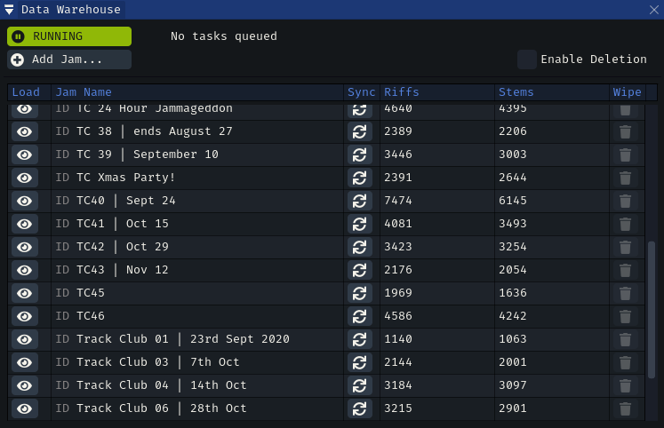
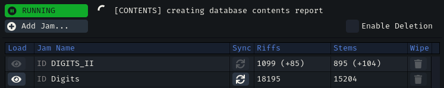
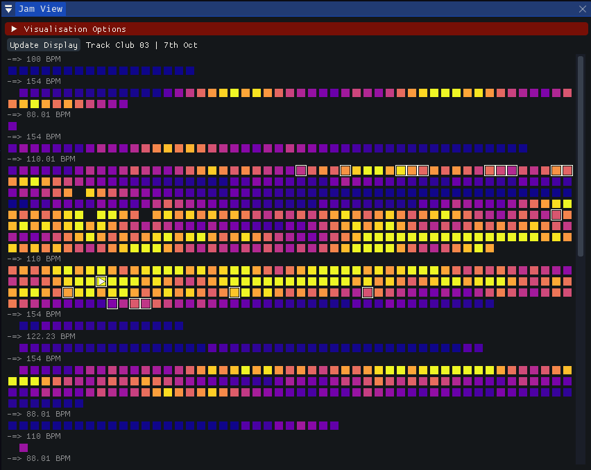
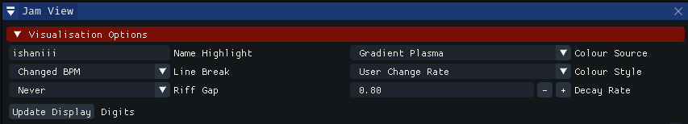
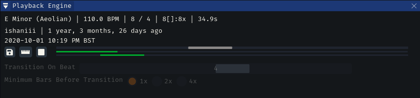
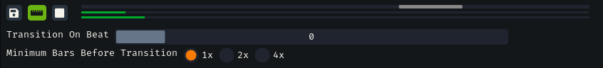
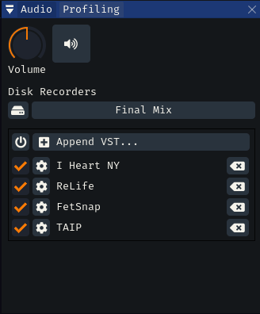

# LORE

___LORE___ allows for offline archival, browsing and playback of any jam you have access to. Enormous 10,000+ riff jams can be browsed seamlessly and interactively, visualised with a number of useful metrics and sequenced with a simple playback engine.

 

 

### Warehouse

The key part of ___LORE___ is the Data Warehouse. This is a view on all the archived jams you have stored locally, as well as where new jams can be synchronised or existing jams updated with the latest changes from the Endlesss servers.

The data is stored in a [*sqlite3* database](https://www.sqlite.org/index.html), found in your Data Storage path under `\cache\common\warehouse.db3` - it can be opened and queried using any off-the-shelf *sqlite3* tools.

When you first run ___LORE___, the warehouse will be empty. Click **[Add Jam...]** to select from your list of known jams and begin the archival process.

A jam being synced will be disabled from view while the database is being updated; `(+###)` values are shown under the *Riffs* and *Stems* columns denoting how many are left to download before the sync completes.

Once you have a jam downloaded you can click the *Eye* icon to load it into the jam view. To sync with the latest data, hit the *Sync* icon.

 

 

### Jam View

The jam view shows all synced riffs, configurably arranged and visualised. Clicking on a riff will schedule it for playback, downloading the stems first if they are not already in the cache. 

Click to unroll the **[Visualisation Options]** at the top to customise colours, spacing and highlights

**NB** currently you need to hit **[Update Display]** after any changes to get the jam view re-rendered with your selection.

 

 

### Riff Playback

Once stems are loaded, the clicked riff will instantly begin playback and have its details displayed inside the *Playback Engine* panel.

This mixer is fairly rudimentary but contains two useful functions

* click the disk icon to export the current riff to disk; you can find the results in your Data Storage path, under
`output\lore\<jam name>\<timestamp>__<unique_id>_<bpm>_<key>`

* enable bar-transition mode with the ruler icon. instead of immediately playing a riff when you choose one in the jam view, this waits until a configurable bar to make the jump. Using this mode you can get a basic but effective riff-hopper. 

To sequence a lot of riffs at once, hold **ALT** and click on your starting riff, then on the end riff. LORE will enqueue all intervening riffs between the two points, forward or backwards.

 

 

### Audio Control

To begin recording the output of ___LORE___ to disk, click the **[Final Mix]** button. A losslessly-compressed FLAC stream will begin writing out to your Data Storage path, `\output\lore\<timestamp>__finalmix.flac`

Click the button again to stop streaming. FLACs can support any length of recording you care to throw at it (___BEAM___ has produced a full 24-hour long one without incident)

Hit the **MUTE** button next to the volume knob to silence output to the audio device but leave disk writing / Discord streaming output running. This is ideal for using OUROVEON tools as streaming tools on a PC that you're also using to play into Endlesss

Add *VST 2.x* effects to the playback with the VST panel; hold **SHIFT** to get rearrangement options. Hit the power-icon to immediately bypass all effects